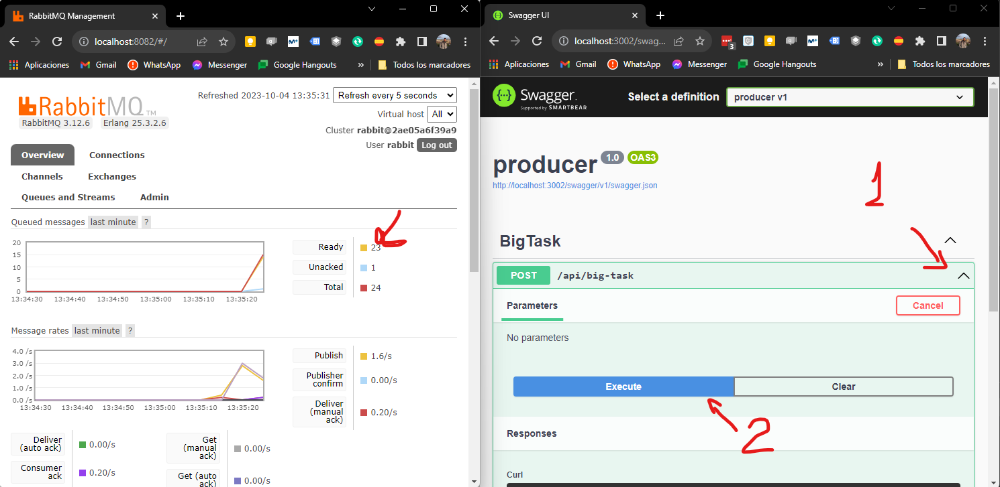

# Example Worker Message Queue

Create a message queue to simulate long tasks running in dotnet using RabbitMq.
These long running task can vary, for example process big files (or files in general), web crawler, db migrations, conciliation processes between 2 ledgers, etc. This code is meant to be as simple as possible.

Just following the tutorial from the official Rabbit documentation:
1. [Introduction](https://www.rabbitmq.com/tutorials/tutorial-one-dotnet.html)
1. [Work Queues](https://www.rabbitmq.com/tutorials/tutorial-one-dotnet.html)

## How to try it

- Install docker
- Run: `docker-compose up -d` (this will start 3 services: producer, rabbit and worker)
- Open the producer. Go to `http://localhost:3002/swagger` (be sure this port is free, if not, change it in the docker compose file)
- Open the RabbitMq. Go to `http://localhost:8082/` and login using user and pass defined in the docker compose file.
- Test it
- Run `docker-compose down`

So far we can test it by make requests using the producer's swagger UI. And we can see how the messages get stuck in the rabbit.

Then we can create new worker instances. Just go to the `docker-compose.yml` file and change the `worker->deploy->replicas` to a higher value. Then run `docker-compose up -d worker` Depending on how hight is the amount of replicas we defined, the ready messages should go down much more faster.

Rules:
- One worker can only perform 1 job at the same time
- Every job will take 10 seconds.

### 1. Initial state, no message queued. Only 1 worker

### 2. Enqueue a lot of work to do

### 3. Add more workers

### 4. Pending scheduled work go down much more faster

